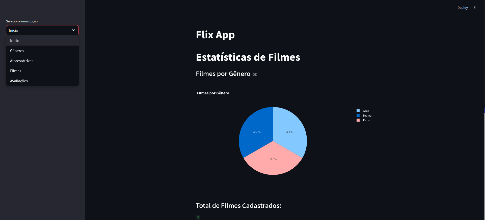

## Flix API README
=====================

## Introduction
---------------

Welcome to Flix API, a Streamlit app that allows users to register film genres, actors, films, ratings, and more.

## Features
------------

* Register film genres
* Register actors
* Register films with associated genres and actors
* Register ratings for films
* Display graphical representations of:
	+ Total number of registered films
	+ Number of films by genre
	+ Total number of ratings submitted
	+ Average rating (in stars) for all films

## Getting Started

To use the Flix API, simply run the Streamlit app and follow the interactive prompts to register data or view graphical representations of the data.

## Technical Details

* Built using Streamlit
* API designed as a library for easy integration with other applications
* Data storage and retrieval handled by PostgreSQL
--------
## Contributing

If you'd like to contribute to the development of Flix API, please [insert contribution guidelines or contact information].

## An illustrative photo of how the system will look.

### CREATED BY - MATHEUS LOBO CAMARA